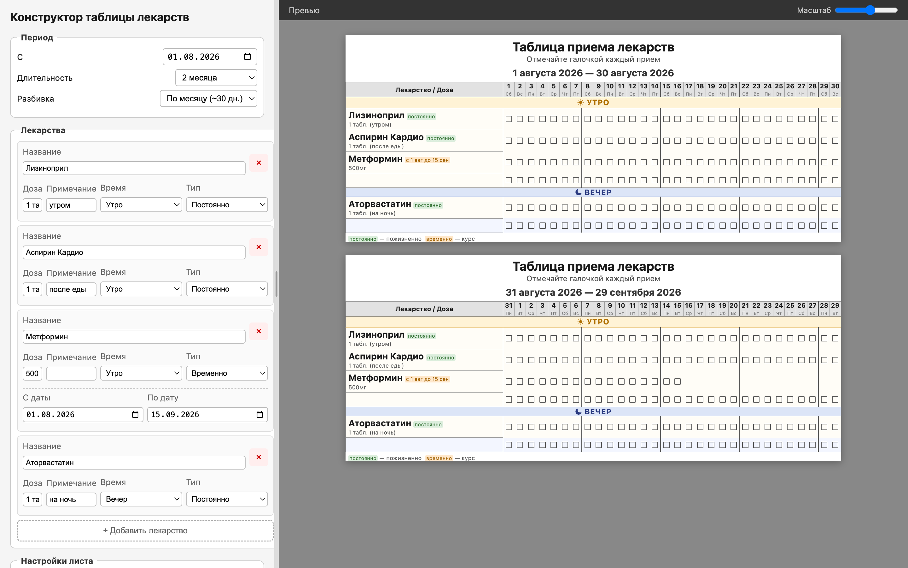

# Конструктор таблицы приёма лекарств

Онлайн-конструктор для создания распечатываемых таблиц приёма лекарств.
Работает полностью в браузере — без сервера, регистрации и фреймворков.

## Возможности

### Управление лекарствами
- Добавление, удаление и редактирование любого количества лекарств
- Для каждого лекарства: название, доза, примечание (когда принимать)
- Время приёма: **утро** / **вечер** — с цветовым разделением в таблице
- Тип приёма: **постоянно** или **временно** с точным диапазоном дат
- Чекбоксы рисуются только в активные дни — для временных курсов автоматически
- Пустые строки для рукописного добавления лекарств (настраиваемое количество)

### Период и разбивка
- Дата начала + длительность 1–4 месяца
- Разбивка на страницы: по неделе, 2 недели, месяцу (~30 дней) или единым блоком
- Реальные даты и дни недели в заголовках столбцов

### Печать
- Автомасштабирование чекбоксов и шрифтов под размер страницы
- Альбомная или книжная ориентация
- Печать напрямую из браузера (каждая страница = отдельный лист)
- Скачивание готового standalone HTML-файла для печати офлайн

### История и резервные копии
- Автоматическая история всех изменений (timeline)
- Восстановление любого предыдущего состояния одним кликом
- Удаление отдельных записей истории
- Экспорт всех данных в JSON-файл
- Импорт из JSON-файла

### Интерфейс
- Живое превью таблицы в реальном времени
- Масштаб превью (30–100%)
- Перетаскиваемый разделитель панелей — ширина формы настраивается мышью
- Все настройки сохраняются автоматически в localStorage

## Использование

Откройте `index.html` в браузере. Настройте лекарства и период, нажмите **«Печать»**.

### Деплой на GitHub Pages

1. Запушьте репозиторий на GitHub
2. Settings → Pages → Source: `master` branch
3. Сайт будет доступен по адресу `https://<username>.github.io/drug-schedule/`

## Технологии

Чистый HTML/CSS/JavaScript, без фреймворков, сборщиков и зависимостей.
